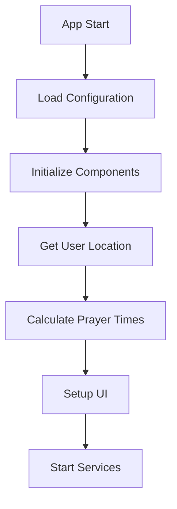

# Adhan - Islamic Prayer Times Application

A modern, feature-rich web application for accurate Islamic prayer times calculation and Adhan notifications.

## Features

### Prayer Time Calculations
- Multiple calculation methods supported:
  - Muslim World League
  - Egyptian General Authority
  - University of Islamic Sciences, Karachi
  - Umm Al-Qura University, Makkah
  - Islamic Society of North America (ISNA)
  - Kuwait
  - Qatar
  - Majlis Ugama Islam Singapura
  - Union Organization Islamic de France
  - Diyanet İşleri Başkanlığı
  - Institute of Geophysics, University of Tehran
- Madhab-specific calculations:
  - Hanafi (Asr time when shadow length = 2x object height)
  - Shafi'i (Asr time when shadow length = 1x object height)
- High latitude prayer time adjustments
- Automatic location detection with manual override
- API fallback system for reliable calculations
- Additional prayer times:
  - Tahajjud (Last third of the night)
  - Suhoor (Ends 10 minutes before Fajr)
  - Ishraq (20 minutes after Sunrise)

### Adhan Player
- Multiple Qari (muezzin) options:
  - Abdul Basit Abdul Samad
  - Al-Hussary
  - Al-Minshawi
  - Al-Ghamdi
  - Mishary Rashid Alafasy
  - Various Madinah and Makkah muezzins
- Special Fajr Adhan support
- Audio features:
  - Volume control
  - Auto-play options
  - Prayer-specific Adhan selection
  - Quality audio from trusted sources
  - Offline playback support
- File browser for selecting specific Adhan audio files
- Download manager for online Adhan files
- Audio fallback system

### Daylight Saving Time (DST) Management
- Automatic DST detection
- Manual DST override options:
  - Always on
  - Always off
  - Auto (system default)
- Custom time adjustments per prayer
- Timezone awareness
- Real-time updates
- DST transition handling

### User Interface
- Modern, clean design
- Theme options:
  - Light mode
  - Dark mode
  - Auto (system preference)
- Responsive layout for all devices
- Prayer time features:
  - Countdown to next prayer
  - Next prayer highlighting
  - Time remaining indicator
  - Prayer status (Current/Next)
- Accessibility features:
  - Screen reader support
  - Keyboard navigation
  - High contrast mode
  - Customizable font sizes

### Additional Features
- Browser notifications:
  - Prayer time alerts
  - Adhan notifications
  - Custom reminder settings
- Offline support:
  - Service worker implementation
  - Cached prayer times
  - Offline audio playback
- Local storage for:
  - User preferences
  - Selected Qaris
  - Custom settings
  - Downloaded audio files
- Multiple language support
- Qibla direction with compass
- Islamic calendar with:
  - Hijri date conversion
  - Important Islamic dates
  - Moon phase indicator

## Technical Architecture

### Frontend Components
```
js/
├── modules/
│   ├── adhan-init.js       # Adhan library initialization
│   ├── adhan-player.js     # Audio playback management
│   ├── adhan.js           # Core prayer time calculations
│   ├── app-init.js        # Application bootstrap
│   ├── dst-handler.js     # DST management
│   ├── islamic-calendar.js # Hijri calendar functions
│   ├── location.js        # Geolocation handling
│   ├── prayer-calculation.js # Prayer time algorithms
│   ├── qibla-compass.js   # Qibla direction
│   └── theme-manager.js   # UI theme handling
```

### Backend Services
```
server/
├── server.js              # Main server file
├── routes/               # API routes
├── controllers/         # Business logic
├── models/             # Data models
└── services/           # External services
```

## Application Workflow

### 1. Initialization Process


### 2. Prayer Time Calculation
1. Get user coordinates (auto/manual)
2. Apply calculation method
3. Adjust for madhab preference
4. Handle high latitude rules
5. Apply DST adjustments
6. Calculate additional times

### 3. Adhan Playback Process
1. Prayer time reached
2. Check notification settings
3. Load appropriate audio file
4. Handle playback states
5. Manage audio fallback

### 4. User Interaction Flow
- Settings modification
- Audio selection
- Theme switching
- Location updates
- Notification management

## API Documentation

### Prayer Time Endpoints
- GET `/prayer-times`: Get prayer times for current location
- GET `/prayer-times/:date`: Get prayer times for specific date
- GET `/qibla`: Get Qibla direction

### Audio Endpoints
- GET `/adhans/:qari/list`: List available audio files
- GET `/adhans/:qari/:file`: Stream audio file
- POST `/adhans/:qari/download`: Download audio file

### Settings Endpoints
- GET `/settings`: Get user settings
- POST `/settings`: Update settings
- GET `/location`: Get user location

## Development

### Prerequisites
- Node.js >= 14.x
- npm >= 6.x
- Modern web browser

### Setup Development Environment
1. Clone repository:
```bash
git clone https://github.com/zub165/Adhan.git
cd Adhan
```

2. Install dependencies:
```bash
npm install
```

3. Start development server:
```bash
npm run dev
```

### Building for Production
1. Create production build:
```bash
npm run build
```

2. Start production server:
```bash
npm start
```

### Testing
- Run unit tests: `npm test`
- Run integration tests: `npm run test:integration`
- Run e2e tests: `npm run test:e2e`

## Deployment

### Deployment Options

#### 1. Traditional Server Deployment
```bash
# Build the application
npm run build

# Start production server
NODE_ENV=production npm start
```

#### 2. Docker Deployment
```bash
# Build Docker image
docker build -t adhan-app .

# Run container
docker run -p 3000:3000 adhan-app
```

#### 3. Cloud Platform Deployment

##### Heroku
```bash
# Login to Heroku
heroku login

# Create new app
heroku create adhan-app

# Push to Heroku
git push heroku main
```

##### Vercel
```bash
# Install Vercel CLI
npm i -g vercel

# Deploy
vercel
```

### Environment Variables
```env
# Server Configuration
PORT=3000
NODE_ENV=production

# API Keys (if needed)
WEATHER_API_KEY=your_key_here
LOCATION_API_KEY=your_key_here

# Database Configuration (if using)
DB_HOST=localhost
DB_USER=user
DB_PASS=password
DB_NAME=adhan_db
```

## Troubleshooting Guide

### Common Issues and Solutions

#### 1. Prayer Time Calculation Issues

##### Incorrect Prayer Times
- **Symptom**: Prayer times don't match local mosque
- **Solution**: 
  1. Verify calculation method
  2. Check coordinates accuracy
  3. Confirm timezone settings
  4. Validate DST settings

##### High Latitude Problems
- **Symptom**: Extreme or invalid prayer times
- **Solution**:
  1. Enable high latitude adjustment
  2. Select appropriate calculation method
  3. Verify latitude value

#### 2. Audio Playback Issues

##### Adhan Not Playing
- **Symptom**: No sound during prayer times
- **Solution**:
  1. Check browser permissions
  2. Verify audio file exists
  3. Confirm volume settings
  4. Clear browser cache

##### Download Failures
- **Symptom**: Cannot download Adhan files
- **Solution**:
  1. Check internet connection
  2. Verify server status
  3. Clear browser cache
  4. Try alternative download source

#### 3. Location Issues

##### Location Not Detected
- **Symptom**: App shows default location
- **Solution**:
  1. Enable location services
  2. Grant browser permissions
  3. Try manual coordinates
  4. Check internet connection

##### Incorrect Location
- **Symptom**: Wrong city or coordinates
- **Solution**:
  1. Refresh location data
  2. Clear location cache
  3. Enter coordinates manually
  4. Update browser settings

#### 4. Performance Issues

##### Slow Loading
- **Symptom**: App takes long to load
- **Solution**:
  1. Clear browser cache
  2. Check internet speed
  3. Disable unused features
  4. Update browser

##### High CPU Usage
- **Symptom**: Browser slows down
- **Solution**:
  1. Close unused tabs
  2. Disable background processes
  3. Update browser
  4. Check system resources

### Debugging Tools

#### Browser Developer Tools
1. Console logging
2. Network monitoring
3. Performance profiling
4. Memory analysis

#### Server Logs
```bash
# View server logs
npm run logs

# Debug mode
DEBUG=* npm start

# Specific component debugging
DEBUG=adhan:* npm start
```

#### Testing Tools
```bash
# Run specific test
npm test -- -t "test-name"

# Debug tests
npm run test:debug

# Coverage report
npm run test:coverage
```

## Security Considerations

### Client-Side Security
1. Input validation
2. XSS prevention
3. CSRF protection
4. Secure storage handling

### Server-Side Security
1. Rate limiting
2. Request validation
3. Error handling
4. Dependency scanning

### API Security
1. Authentication
2. Authorization
3. Data validation
4. Response sanitization

## Performance Optimization

### Frontend Optimization
1. Code splitting
2. Lazy loading
3. Asset optimization
4. Caching strategies

### Backend Optimization
1. Response caching
2. Database indexing
3. Query optimization
4. Load balancing

## Monitoring and Analytics

### Application Monitoring
1. Error tracking
2. Performance metrics
3. User analytics
4. Usage statistics

### Server Monitoring
1. Resource usage
2. Response times
3. Error rates
4. System health

## Contributing

1. Fork the repository
2. Create feature branch: `git checkout -b feature/YourFeature`
3. Commit changes: `git commit -am 'Add YourFeature'`
4. Push to branch: `git push origin feature/YourFeature`
5. Submit pull request

## License

This project is licensed under the MIT License - see the [LICENSE](LICENSE) file for details.

## Acknowledgments

- [Adhan.js](https://github.com/batoulapps/adhan-js) for prayer time calculations
- Various Qaris for audio contributions
- Community feedback and support

## Support

For support, please:
1. Check the [Issues](https://github.com/zub165/Adhan/issues) page
2. Create a new issue if needed
3. Join our [Discord community](#)
