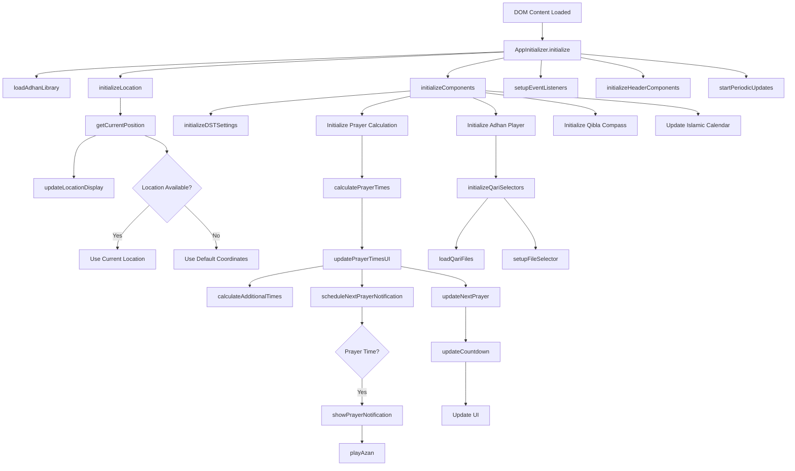

# Adhan - Islamic Prayer Times Application

A modern, feature-rich web application for accurate Islamic prayer times calculation and Adhan notifications.

## Features

### Prayer Time Calculations
- Multiple calculation methods supported (Muslim World League, Egyptian, Karachi, etc.)
- Madhab-specific calculations (Hanafi, Shafi, etc.)
- High latitude prayer time adjustments
- Automatic location detection
- API fallback system for reliable calculations
- Additional prayer times (Tahajjud, Suhoor, Ishraq)

### Adhan Player
- Multiple Qari (muezzin) options
- Special Fajr Adhan support
- Audio fallback system
- Quality audio from trusted sources
- Volume control and customization
- File browser for selecting specific Adhan audio files

### Daylight Saving Time (DST) Management
- Automatic DST detection
- Manual DST override options
- Custom time adjustments
- Timezone awareness
- Real-time updates

### User Interface
- Clean, modern design
- Dark/Light mode support
- Responsive layout
- Prayer time countdown
- Next prayer highlighting
- Accessibility features

### Additional Features
- Browser notifications
- Offline support
- Local storage for preferences
- Multiple language support
- Qibla direction
- Islamic calendar

## Installation

1. Clone the repository:
```bash
git clone https://github.com/yourusername/Adhan.git
cd Adhan
```

2. Install dependencies:
```bash
npm install
```

3. Start the application:
```bash
npm start
```

4. Open your browser and navigate to:
```
http://localhost:3000
```

## Configuration

### Prayer Time Settings
- Select calculation method in settings
- Choose madhab preference
- Adjust high latitude rules if needed
- Configure DST handling

### Audio Settings
- Select preferred Qari
- Set volume levels
- Configure notification preferences
- Choose Fajr-specific settings
- Browse and select specific Adhan audio files

### Location Settings
- Enable automatic location detection
- Set manual coordinates if preferred
- Configure timezone settings
- Adjust DST preferences

## File Structure

```
Adhan/
├── index.html                # Main application entry
├── server.js                 # Node.js server for serving files and handling API requests
├── package.json              # Project configuration
├── package-lock.json         # Dependency lock file
├── css/                      # CSS styles
│   └── styles.css            # Global styles
├── js/                       # JavaScript files
│   └── modules/              # Core functionality modules
│       ├── adhan-init.js     # Adhan library initialization
│       ├── adhan-player.js   # Adhan audio player functionality
│       ├── adhan.js          # Adhan library wrapper
│       ├── app-init.js       # Application initialization
│       ├── dst-handler.js    # Daylight Saving Time management
│       ├── islamic-calendar.js # Islamic calendar calculations
│       ├── location.js       # Location detection and management
│       ├── prayer-calculation.js # Prayer time calculations
│       ├── qibla-compass.js  # Qibla direction calculator
│       └── theme-manager.js  # UI theme management
├── adhans/                   # Adhan audio files
│   ├── default/              # Default Adhan audio
│   ├── islamcan/             # IslamCan Adhan audio
│   └── [other Qaris]/        # Other Qari audio files
├── assets/                   # Static assets
├── icons/                    # UI icons
└── INSTALL.md                # Installation instructions
```

## Core Modules and Functionality

### Prayer Calculation Module (`prayer-calculation.js`)

The Prayer Calculation module is responsible for calculating prayer times and managing prayer-related functionality.

#### Key Functions:

1. **initialize(coordinates)**
   - Initializes the prayer calculation module with user coordinates
   - Sets up calculation parameters based on user preferences

2. **calculatePrayerTimes(coordinates)**
   - Calculates standard prayer times (Fajr, Sunrise, Dhuhr, Asr, Maghrib, Isha)
   - Uses the Adhan.js library with configured parameters
   - Handles timezone and DST adjustments

3. **calculateAdditionalTimes(prayerTimes)**
   - Calculates additional prayer times:
     - Tahajjud (last third of the night)
     - Suhoor (ends 10 minutes before Fajr)
     - Ishraq (20 minutes after Sunrise)

4. **updatePrayerTimesUI(prayerTimes)**
   - Updates the UI with calculated prayer times
   - Formats times for display
   - Updates next prayer indicators

5. **updateNextPrayer(prayerTimes, additionalTimes)**
   - Determines the next upcoming prayer
   - Highlights the next prayer in the UI
   - Sets up countdown timer

6. **scheduleNextPrayerNotification(prayerTimes, additionalTimes)**
   - Schedules notifications for upcoming prayers
   - Calculates time until next prayer
   - Sets up timeout for notification

7. **showPrayerNotification(prayerName)**
   - Displays browser notification for prayer time
   - Plays Adhan audio if enabled
   - Formats prayer name for display

8. **updateCountdown(element, targetTime)**
   - Updates countdown timer for next prayer
   - Calculates hours and minutes remaining
   - Formats countdown text

### Adhan Player Module (`adhan-player.js`)

The Adhan Player module manages audio playback for prayer calls.

#### Key Functions:

1. **initialize(prayerCalculation)**
   - Sets up the Adhan player with prayer calculation module
   - Initializes audio elements
   - Sets up event listeners

2. **initializeQariSelectors()**
   - Creates Qari selection dropdowns for each prayer
   - Loads available Qaris
   - Sets up file browser for audio selection

3. **loadQariFiles(qari, prayerType)**
   - Loads audio files for selected Qari
   - Filters files by prayer type
   - Updates audio selection dropdown

4. **showFileSelector(prayerType)**
   - Displays modal for browsing Adhan audio files
   - Populates with available Qaris and files
   - Handles file selection

5. **playAzan(prayerType)**
   - Plays Adhan audio for specified prayer
   - Handles audio loading and error states
   - Manages volume control

6. **stopAzan(prayerType)**
   - Stops currently playing Adhan
   - Resets audio state

### Application Initialization Module (`app-init.js`)

The Application Initialization module handles the startup process and coordinates other modules.

#### Key Functions:

1. **initialize()**
   - Entry point for application startup
   - Loads required libraries
   - Initializes all components

2. **initializeLocation()**
   - Gets user location
   - Updates location display
   - Falls back to default coordinates if needed

3. **initializeComponents()**
   - Sets up prayer calculation
   - Initializes Adhan player
   - Sets up Qibla compass
   - Initializes Islamic calendar

4. **setupEventListeners()**
   - Sets up UI interaction handlers
   - Manages settings changes
   - Handles notification permissions

5. **startPeriodicUpdates()**
   - Sets up timers for regular updates
   - Updates prayer times, calendar, and DST status
   - Refreshes location periodically

### DST Handler Module (`dst-handler.js`)

The DST Handler module manages Daylight Saving Time adjustments.

#### Key Functions:

1. **getDSTAdjustment()**
   - Determines if DST is active
   - Returns adjustment value (0 or 1)

2. **getTimezoneWithDST()**
   - Gets current timezone with DST consideration
   - Formats for display

### Server Module (`server.js`)

The server module provides backend functionality for the application.

#### Key Functions:

1. **startServer(port)**
   - Initializes HTTP server
   - Sets up route handlers
   - Configures CORS and headers

2. **Audio File Listing**
   - Handles requests to list available audio files
   - Filters for MP3 files
   - Returns JSON response with file list

## Application Workflow



## Prayer Time Calculation Process

1. **User Location Detection**
   - Application gets user coordinates
   - Falls back to default if unavailable

2. **Calculation Method Selection**
   - User selects preferred calculation method
   - Parameters are configured accordingly

3. **Prayer Time Calculation**
   - Standard prayer times calculated using Adhan.js
   - Additional times calculated based on standard times
   - DST and timezone adjustments applied

4. **UI Update**
   - Prayer times displayed in UI
   - Next prayer highlighted
   - Countdown timer started

5. **Notification Scheduling**
   - Time until next prayer calculated
   - Notification scheduled
   - Adhan playback prepared

## Adhan Playback Process

1. **Qari Selection**
   - User selects preferred Qari for each prayer
   - Audio files loaded for selected Qari

2. **File Selection**
   - User can browse available audio files
   - Select specific Adhan for each prayer

3. **Playback**
   - Adhan played at prayer time
   - Manual playback available
   - Volume control applied

## Contributing

1. Fork the repository
2. Create your feature branch
3. Commit your changes
4. Push to the branch
5. Create a Pull Request

## License

This project is licensed under the MIT License - see the [LICENSE](LICENSE) file for details.

## Acknowledgments

- Adhan.js library for prayer time calculations
- Various Qari contributions for audio files
- Community feedback and support